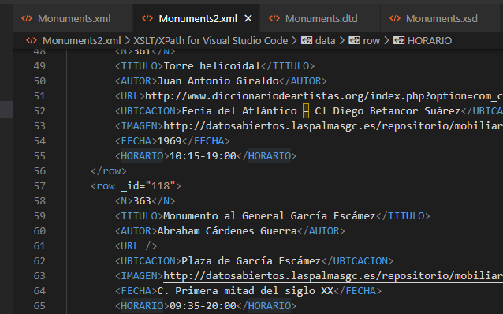
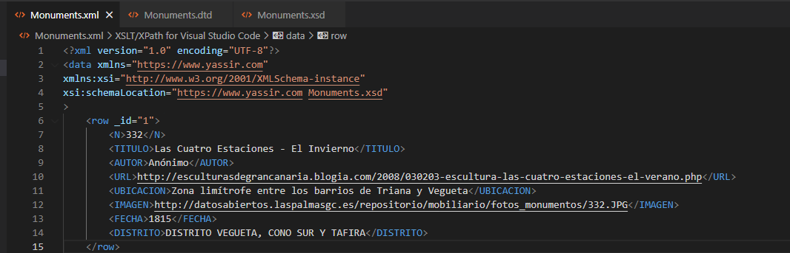

# LNDMonumentsAPI

LNDMonumentsAPI is an api used to transmit tourist information to a possible app, which would show information and points of interest of the island of Las Palmas de Gran Canaria to possible tourists.

-----------------------------------------------------------------------------------------------------------------------------

### Example of information used in the APP-API
```
<row _id="1">
        <N>332</N>
        <TITULO>Las Cuatro Estaciones - El Invierno</TITULO>
        <AUTOR>Anónimo</AUTOR>
        <URL>http://esculturasdegrancanaria.blogia.com/2008/030203-escultura-las-cuatro-estaciones-el-verano.php</URL>
        <UBICACION>Zona limítrofe entre los barrios de Triana y Vegueta</UBICACION>
        <IMAGEN>http://datosabiertos.laspalmasgc.es/repositorio/mobiliario/fotos_monumentos/332.JPG</IMAGEN>
        <FECHA>1815</FECHA>
        <DISTRITO>DISTRITO VEGUETA, CONO SUR Y TAFIRA</DISTRITO>
    </row>
```

This code has two variants, one of them contains the label "district" which shows the district where the monument is located, the second variant contains the time at which it is possible to visit these monuments.

_Example of validation [1]_
```
<?xml version="1.0" encoding="UTF-8"?>
<!ELEMENT data (row+)>
<!ATTLIST row _id CDATA #REQUIRED>
<!ELEMENT row (N,TITULO,AUTOR,URL,UBICACION,IMAGEN,FECHA,DISTRITO?,HORARIO?)>
<!ELEMENT N (#PCDATA)>
<!ELEMENT TITULO (#PCDATA)>
<!ELEMENT AUTOR (#PCDATA)>
<!ELEMENT URL (#PCDATA)>
<!ELEMENT UBICACION (#PCDATA)>
<!ELEMENT IMAGEN (#PCDATA)>
<!ELEMENT FECHA (#PCDATA)>
<!ELEMENT DISTRITO (#PCDATA)>
<!ELEMENT HORARIO (#PCDATA)>
```
_Example of validation [in use]_
```
<xs:schema xmlns:xs="http://www.w3.org/2001/XMLSchema" targetNamespace="https://www.yassir.com"
    xmlns="https://www.yassir.com" elementFormDefault="qualified">
    <xs:element name="data">
        <xs:complexType>
            <xs:sequence>
                <xs:element name="row" minOccurs="1" maxOccurs="unbounded">
                    <xs:complexType>
                        <xs:sequence>
                            <xs:element name="N" minOccurs="1" maxOccurs="1" type="xs:integer"></xs:element>
                            <xs:element name="TITULO" minOccurs="1" maxOccurs="1" type="xs:string"></xs:element>
                            <xs:element name="AUTOR" minOccurs="1" maxOccurs="1" type="xs:string"></xs:element>
                            <xs:element name="URL" minOccurs="1" maxOccurs="1" type="xs:string"></xs:element>
                            <xs:element name="UBICACION" minOccurs="1" maxOccurs="1" type="xs:string"></xs:element>
                            <xs:element name="IMAGEN" minOccurs="1" maxOccurs="1" type="xs:string"></xs:element>
                            <xs:element name="FECHA" minOccurs="1" maxOccurs="1" type="xs:string"></xs:element>
                            <xs:element name="DISTRITO" minOccurs="0" maxOccurs="1" type="xs:string"></xs:element>
                            <xs:element name="HORARIO" minOccurs="0" maxOccurs="1" type="xs:string"></xs:element>
                        </xs:sequence>
                        <xs:attribute name="_id" type="xs:integer"/>
                    </xs:complexType>                   
                </xs:element>
            </xs:sequence>
        </xs:complexType>
    </xs:element>
</xs:schema>
```

### Validated information
<p align="center">
  
  
</p>

As you can see in the images both xml were validated with a visual estudio plugin to validate xml code in vase to xsd files.

-----------------------------------------------------------------------------------------------------------------------------

## Tools Links


[Plugin usde for VSC](https://marketplace.visualstudio.com/items?itemName=redhat.vscode-xml)</li><br>
[Visual Studio Code](https://code.visualstudio.com/)</li>


------------------------------------------------------------------------------------------------------------------------------
## Links used
[Used Data Download.](http://datosabiertos.laspalmasgc.es/dataset/?id=monumentos)<br>
[General open data portal of the government of the canary islands.](https://datos.canarias.es/portal/)<br>
[GitHub documentation readme.](https://docs.github.com/es/get-started/writing-on-github/working-with-advanced-formatting)<br>
[Policy on the use of the data used.](https://www.laspalmasgc.es/es/otras-secciones/aviso-legal/)<br>
[Open data portal of the government of the canary islands.](http://datosabiertos.laspalmasgc.es/)<br>
